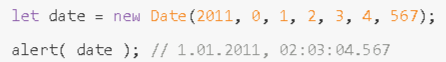
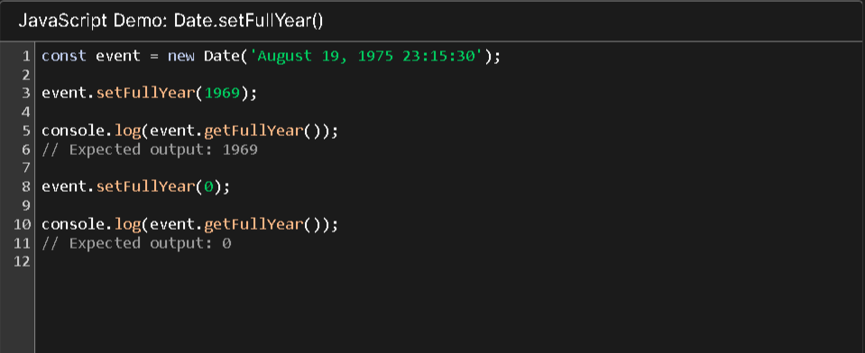

## What is New Date () in Javascript
### Date() Конструктор создает Date объекты. При вызове как функции он возвращает строку, представляющую текущее время

## New Date()
### DateОбъекты JavaScript представляют единый момент времени в формате, не зависящем от платформы. Dateобъекты инкапсулируют целое число, представляющее миллисекунды, прошедшие с полуночи в начале 1 января 1970 года по UTC эпохи

## New getMilliseconds()
### getMilliseconds()Метод из Date экземпляров возвращает миллисекунды для этой даты в соответствии с местным временем.

## New Date (year, month, day, hours, minutes, seconds, milliseconds)
### Создать объект Date с заданными компонентами в местном часовом поясе. Обязательны только первые два аргумента. year должен состоять из четырёх цифр: значение 2013 корректно, 98 – нет. month начинается с 0 (январь) по 11 (декабрь).
### Параметр date здесь представляет собой день месяца. Если параметр не задан, то принимается значение 1.
### Если параметры hours/minutes/seconds/ms отсутствуют, их значением становится 0.

## Method New Date()

## Now()
### Метод now() является статическим методом для объекта Date и возвращает значение во времени в миллисекундах. Вы можете передать миллисекунды, возвращаемые методом now(), в конструктор Date для создания экземпляра нового объекта Date.

## getFullYear()
### Метод getFullYear() используется для получения текущего года и экземпляра объекта Date. Этот метод вернет год указанной даты в конструкторе Date.

## getMonth()
### getMonth()Метод Date экземпляров возвращает месяц для этой даты в соответствии с местным временем как значение, основанное на нуле (где ноль указывает первый месяц года).

## getDate()
### getDate()Метод Date экземпляров возвращает день месяца для этой даты в соответствии с местным временем.

## getDay()
### getDay()Метод Date экземпляров возвращает день недели для этой даты в соответствии с местным временем, где 0 соответствует воскресенью

## getHours()
### getHours()Метод Date экземпляров возвращает часы для этой даты в соответствии с местным временем.

## getMinutes()
### getMinutes()Метод Date экземпляров возвращает минуты для этой даты в соответствии с местным временем.

## Set date()
### setDate()Метод Date экземпляров изменяет день месяца для этой даты в соответствии с местным временем.

## Set Month()
### Метод setMonth() устанавливает месяц указанной даты по местному времени.

## Set FullYear()
### setFullYear()Метод Date экземпляров изменяет год, месяц и /или день месяца для этой даты в соответствии с местным временем.

